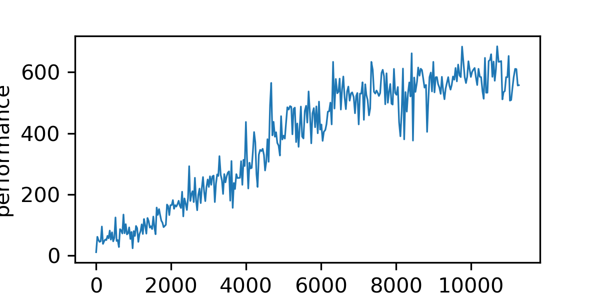
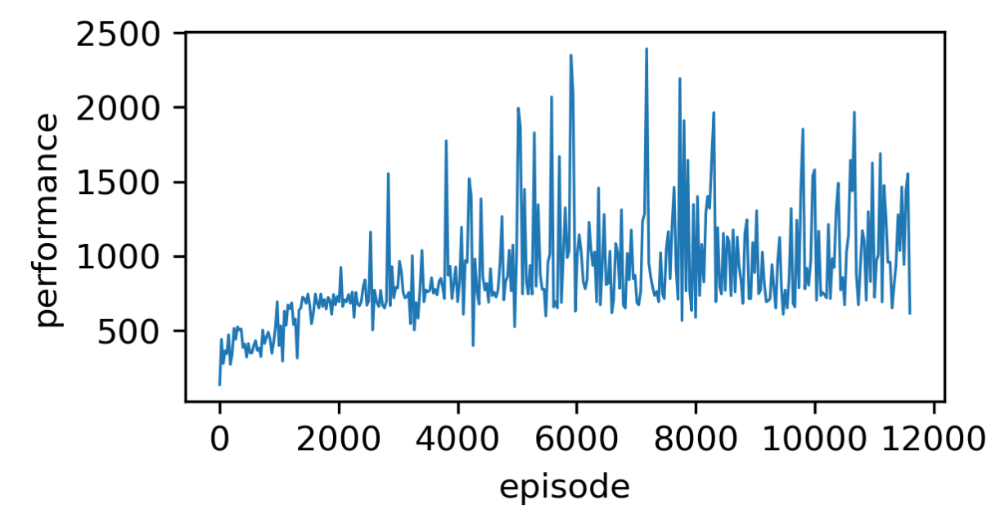
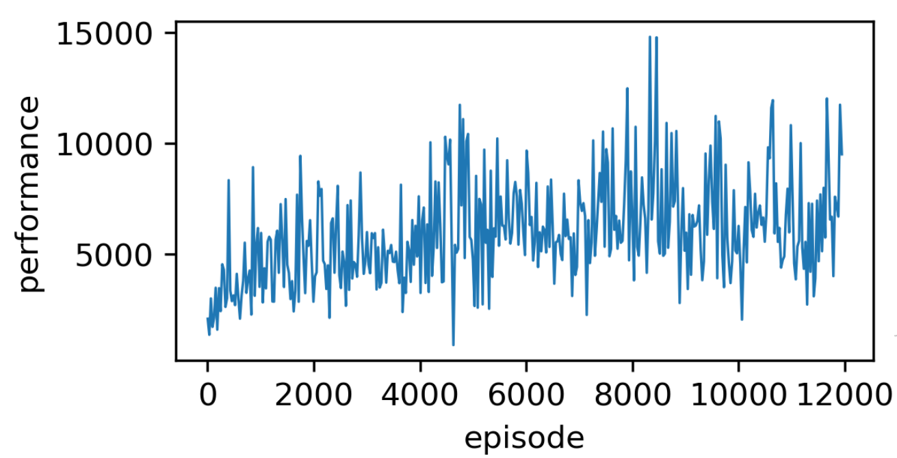
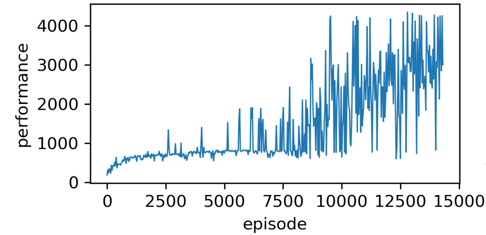

## Deep Q-Learning

Article: Mnih, et al. Playing atari with deep reinforcement learning. In NIPS Deep Learning Workshop. 2013.

### Intuition

结合深度神经网络在模式识别上的能力，做一个端到端的强化学习算法

### Model Architecture

- CNN1, 16 8x8 filters, stride=4, input=4x84x84, output=16x20x20
- ReLU
- CNN2, 32 4x4 filters, stride=2, input=16x20x20, output=32x9x9
- ReLU
- FC1, input: 32x9x9, output:256
- ReLU
- Output layer: input 256, output: the number of actions (no softmax)

### Preprocessing

[Mnih et al. 2013]

input: 210x160
1. RGB to gray-scale
2. down-sampling to a 110x84
3. crop an 84x84 region of the image

[Mnih et al. 2015]
input: 210x160
1. encode a single frame: take the maximum value for each pixel colour value over the frame being encoded and the previous frame. like np.maximum(now_frame, previou_frame)
benefit: remove flicking
why flicking? some objects only in even frames or odd frames
2. RGB to gray-scale
3. scale to 84x84

Notice: the preprocessing will be applied to the m most recent frames and stacks them to produce the input to the Q-function, most time m=4

## PPO(PPO2)

[Schulman et al., 2017]

### Atari
Tmax = 40M

with initilization scheme for ANN Model
test case: Amidar

1. 无advantage norm, Horizon=128, new GAE计算代码
test: Centipede

2. 修复 Loss计算处的bug(Loss or GAE符号取错了)

   ​	test: Centipede, Assault, Qbert,Amidar
   
   ​	依旧不收敛

3. 修复计算图没有成功构成的bug(loss_advantage 没有grad_fn属性)
  
   1. 重写了loss_advantage的计算过程，采用了nll_loss
   2. 结果表示收敛
   
4. 重写了entropy项，

   1. 有bug，model里的prob 存在Nan值
   
5. 将actor与critic的loss分开

   1. 4中的bug来自于log2函数的反向传播，解决方法为:log2(..+EPS), EPS=1e-10
   2. 有advantage norm

### Experiment Results

Amidar-v0(objective: 674)

Assault-v0(objective:4971)

Centipede-v0(objective:4386.4)

Qbert-v0(objective:14293)

## DDPG

[Lillicrap  et al., 2015]

### MuJoCo
reference paper[Fujimoto et al., 2018]

problem:
1. actor测试的结果几乎不变(Ant-v2环境)
   1. 解决的方法：不采用原文中对模型的初始化方法，采用pytorch的默认初始化方法
   2. 原因猜测：模型初始化后在非激活区，导致对模型参数变化少。

## Ref
1. Mnih V, Kavukcuoglu K, Silver D, et al. Playing atari with deep reinforcement learning[J]. arXiv preprint arXiv:1312.5602, 2013.
2. Mnih V, Kavukcuoglu K, Silver D, et al. Human-level control through deep reinforcement learning[J]. Nature, 2015, 518(7540): 529.
3. Lillicrap T P, Hunt J J, Pritzel A, et al. Continuous control with deep reinforcement learning[J]. arXiv preprint arXiv:1509.02971, 2015.
4. Schulman J, Wolski F, Dhariwal P, et al. Proximal Policy Optimization Algorithms.[J]. arXiv: Learning, 2017.
5. Fujimoto S, Van Hoof H, Meger D, et al. Addressing Function Approximation Error in Actor-Critic Methods[J]. international conference on machine learning, 2018: 1582-1591.

